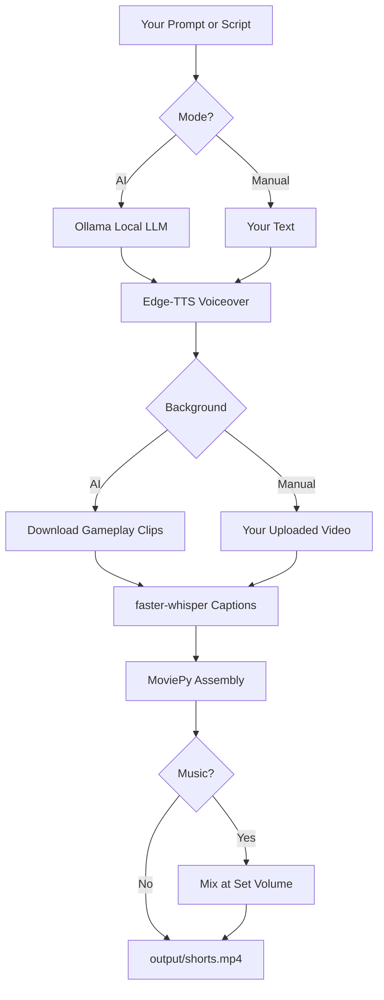

<p align="center">
  
  
  
  
</p>

<h1 align="center">🎬 Make Shorts</h1>
<h3 align="center">Turn a single prompt into a viral-ready YouTube Short.<br/>No subscriptions. No tokens. No cloud bills.</h3>

<p align="center">
  <strong>AI scriptwriting</strong> · <strong>Neural voiceover</strong> · <strong>Gameplay backgrounds</strong> · <strong>Word-synced captions</strong> · <strong>Beautiful web UI</strong>
</p>

<p align="center">
  <a href="#-launch-the-ui">Launch UI</a> ·
  <a href="#-two-ways-to-create">Two Modes</a> ·
  <a href="#-what-you-get">Features</a> ·
  <a href="#-quick-start">Quick Start</a> ·
  <a href="#-fonts--styling">Fonts</a>
</p>

---

## ⚡ What is this?

**Make Shorts** is a local-first video automation engine built for **high-retention short-form content** — YouTube Shorts, TikTok, and Reels.

Give it a topic (or your own script + video) and it outputs a **1080×1920 vertical MP4** with:

| Layer | What happens |
|-------|-------------|
| 🧠 **Script** | Ollama writes a hook-first, 40–55s viral script |
| 🎙️ **Voice** | Edge-TTS generates unlimited free voiceover |
| 🎮 **Visuals** | Gameplay footage auto-downloaded & fast-cut every 3–5s |
| 💬 **Captions** | Whisper syncs word-level timestamps → viral pill captions |
| 🎵 **Music** | Optional background track with volume slider (UI) |
| 📦 **Output** | Upload-ready `output/shorts_*.mp4` |

> **Everything runs on your machine.** Script, transcription, and rendering are local. Only gameplay downloads and TTS need internet.

---

## 🖥 Launch the UI

The fastest way to use Make Shorts:

```bash
pip install -r requirements.txt
python ui/app.py
```

Open **http://127.0.0.1:5000**

```
┌─────────────────────────────────────┐
│           🎬 Make Shorts            │
│                                     │
│   ┌───────────┐   ┌───────────┐    │
│   │ 🤖 AI Mode │   │ ✋ Manual  │    │
│   │  1-click   │   │  Full ctrl │    │
│   └───────────┘   └───────────┘    │
└─────────────────────────────────────┘
```

---

## 🎯 Two Ways to Create

### 🤖 AI Mode
1. Enter a topic — *"mind-blowing psychology facts"*
2. *(Optional)* Upload background music + set volume slider
3. Hit **Generate Short**
4. Download your video

The pipeline handles everything: script → voice → gameplay → captions → render.

### ✋ Manual Mode
Full creative control:

| Control | Options |
|---------|---------|
| **Background video** | Upload any MP4/MOV from your storage |
| **Script** | Custom text box — your exact words |
| **Font style** | 11 fonts including **robotic / sci-fi** options |
| **Colors** | Text, highlight, accent, pill — color pickers |
| **Background music** | Optional upload + volume dragger (0–50%) |
| **Highlights** | Toggle auto power-word coloring |

---

## ✨ What You Get

### Viral Caption Engine
- **1–3 word chunks** synced to Whisper timestamps (millisecond precision)
- Thick black stroke + drop shadow for readability
- Rounded semi-transparent pill background
- Positioned at **62% vertical** — above platform UI overlays
- Dynamic yellow/green highlights on power words

### Gameplay Background System
- Auto-downloads free stock gameplay from Pexels
- **Fast-cut rhythm** — new clip every 3–5 seconds (not 16s static slides)
- Split-screen layout every 3rd cut for visual variety
- Ken Burns zoom (1.0 → 1.15) + micro-shake on cuts

### Background Music Mixer
- Upload any MP3/WAV/M4A track in the UI
- **Volume slider** controls how loud music plays *behind* the voice
- Music auto-loops to match video length
- Voice always stays at full volume

### 11 Caption Fonts

| Category | Fonts |
|----------|-------|
| **Viral / Bold** | Impact, Arial Black, Montserrat Black, Bold Sans |
| **Robotic / Sci-Fi** | Orbitron, Audiowide, Share Tech Mono, Rajdhani, Exo 2, Roboto Mono, Press Start 2P |

---

## 🚀 Quick Start

### Prerequisites

| Tool | Install | Required? |
|------|---------|-----------|
| **Python 3.9+** | [python.org](https://python.org) | ✅ |
| **ffmpeg** | `brew install ffmpeg` (Mac) | ✅ |
| **Ollama** | [ollama.com](https://ollama.com) | AI Mode only |

```bash
# Pull the script-writing model (one-time, ~2 GB)
ollama pull llama3.2
```

### Install & Run

```bash
git clone <your-repo>
cd make_shorts
pip install -r requirements.txt

# Web UI (recommended)
python ui/app.py

# CLI (AI mode)
python make_shorts.py "how to build confidence"

# CLI (manual gameplay)
python make_shorts.py --script my_script.txt --gameplay ./my_clips/
```

---

## 🧠 Pipeline Architecture



---

## 📁 Project Structure

```
make_shorts/
├── make_shorts.py        # Core pipeline engine
├── ui/
│   ├── app.py            # Flask web UI
│   ├── templates/        # Home, AI Mode, Manual Mode pages
│   └── static/           # CSS + JS
├── fonts/                # Robotic & viral fonts (bundled)
├── gameplay/             # Cached gameplay clips
├── uploads/              # User-uploaded videos (manual mode)
├── music/                # User-uploaded music tracks
├── output/               # Finished MP4s
└── temp/                 # Voiceover cache
```

---

## 🎨 Fonts & Styling

Bundled robotic fonts live in `fonts/`:

```
Orbitron-Bold.ttf        → Sci-fi robotic
Audiowide-Regular.ttf    → Retro robot
ShareTechMono-Regular.ttf → Tech monospace
Rajdhani-Bold.ttf        → Futuristic
Exo2-Bold.ttf            → Modern tech
RobotoMono-Bold.ttf      → Code style
PressStart2P-Regular.ttf → 8-bit pixel robot
```

In **Manual Mode**, pick any font from the dropdown and customize all colors live.

---

## 🛠 CLI Reference

```bash
# Full AI pipeline
python make_shorts.py "your topic"

# Your own script
python make_shorts.py --script script.txt

# Your own gameplay folder
python make_shorts.py "topic" --gameplay ./clips/

# Your own images (Ken Burns mode)
python make_shorts.py "topic" --images ./photos/
```

Output: `output/shorts_final.mp4`

---

## ⚙️ Configuration

Key constants in `make_shorts.py`:

```python
W, H = 1080, 1920          # 9:16 resolution
CAPTION_Y_CENTER = 0.62      # Caption sweet spot
IMAGE_CUT_MIN = 3.0          # Fast-cut min seconds
IMAGE_CUT_MAX = 5.0          # Fast-cut max seconds
TTS_VOICE = "en-US-GuyNeural"  # Change voice here
```

List all Edge-TTS voices:
```bash
edge-tts --list-voices
```

---

## ⚠️ Troubleshooting

<details>
<summary><strong>Ollama connection refused</strong></summary>

Start Ollama before using AI Mode:
```bash
ollama serve
# or open the Ollama desktop app
ollama pull llama3.2
```
</details>

<details>
<summary><strong>ffmpeg not found</strong></summary>

```bash
# Mac
brew install ffmpeg
export PATH="/opt/homebrew/bin:$PATH"

# Linux
sudo apt install ffmpeg
```
</details>

<details>
<summary><strong>Video looks blank / dark</strong></summary>

Gameplay download may have failed. Use **Manual Mode** and upload your own MP4, or check your internet connection.
</details>

<details>
<summary><strong>Render is slow</strong></summary>

Normal for local CPU rendering. A 50s Short takes ~2–5 min. Speed tips:
- Set `WHISPER_MODEL = "tiny"` in `make_shorts.py`
- Lower `FPS` to 24
</details>

---

## 🎓 Pro Tips for Viral Shorts

1. **Hook in 1 second** — start with a bold claim or question
2. **Title = first line** of your script
3. **Music at 10–20%** volume — audible but never competing with voice
4. **Robotic fonts** (Orbitron, Audiowide) crush it for tech/gaming niches
5. **Post 11 AM–1 PM** and **7–9 PM** in your audience's timezone

---

## 📜 License

Do whatever you want. Build your channel. No attribution required.

<p align="center">
  <strong>Built for creators who ship.</strong><br/>
  <sub>Zero API keys · Zero limits · Zero excuses.</sub>
</p>
